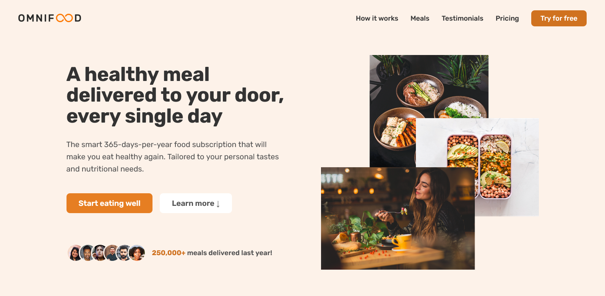

# 🍽️ Omnifood — AI-Powered Food Subscription Website

Omnifood is a **fictional food subscription brand** built as a **pure HTML & CSS project**.  
The goal of this project is to design and structure a modern, responsive marketing website based on provided content and branding guidelines — **without using JavaScript**.

---

### Screenshot

### Links

- Live Site URL: [Vercel](https://omnifood-project-five.vercel.app)

## 📌 About Omnifood

Omnifood is a technology-first company focused on improving consumer well-being through a healthy diet.  
Busy schedules often lead to poor eating habits, so Omnifood solves this problem using an **AI-driven meal planning approach**.

Users can:

- Select their dietary preferences
- Indicate foods they like or dislike
- Receive a **custom weekly meal plan** generated by AI

Omnifood partners with local restaurants and cooking partners to **prepare and deliver meals** directly to users.  
All meals are offered through a **monthly subscription**, with flexible options for one or two meals per day.

---

## 🧠 Project Objective

The objective of this project was to:

- Translate a detailed product brief into a real-world website layout
- Practice **semantic HTML structure**
- Apply **modern CSS techniques**
- Build a complete landing page **without JavaScript**

---

## 🧩 Website Content Overview

### ✨ Summary

> The smart 365-days-per-year food subscription that will make you eat healthy again.  
> Tailored to your personal tastes and nutritional needs.  
> **250,000+ meals delivered last year!**

---

### 🚀 Omnifood Features

- **Never cook again** — 365 days per year, including holidays
- **Local & organic** — fresh, organic ingredients only
- **No waste** — reusable containers used by all partners
- **Pause anytime** — pause your subscription and get refunded for unused days

---

### 🛠️ How Omnifood Works

**Your daily dose of health in 3 simple steps:**

1. **Tell us what you like (and what not)**  
   Omnifood AI generates a fully personalized weekly meal plan.

2. **Approve your weekly meal plan**  
   Swap meals, change ingredients, or add your own recipes.

3. **Receive meals at a convenient time**  
   Meals are cooked by top chefs and delivered to your door daily.

---

### 🥗 Supported Diets

Omnifood works with **any diet**, including:

- Vegetarian
- Vegan
- Pescatarian
- Gluten-free
- Lactose-free
- Keto
- Paleo
- Low FODMAP
- Kid-friendly

---

### 🍱 Sample Meals

**Omnifood AI chooses from 5,000+ recipes**

**Japanese Gyozas**

- Category: Vegetarian
- Calories: 650
- NutriScore®: 74
- Rating: ⭐ 4.9 (537 reviews)

**Avocado Salad**

- Category: Vegan & Paleo
- Calories: 400
- NutriScore®: 92
- Rating: ⭐ 4.8 (441 reviews)

---

### 🎁 Free Sample Meal

Users can sign up for a **free first meal** via a simple form.

> Healthy, tasty, and hassle-free meals are waiting for you.  
> Cancel or pause anytime — the first meal is on us!

---

### 💳 Pricing Plans

Prices include all applicable taxes.

**Starter — $399 / month**

- 1 meal per day
- Order between 11am – 9pm
- Free delivery

**Complete — $649 / month**

- 2 meals per day
- Order 24/7
- Free delivery
- Access to latest recipes

---

### 📸 Photo Gallery

A responsive gallery showcasing **12 provided food and lifestyle images**.

---

## 🛠️ Built With

- **HTML5** (semantic markup)
- **CSS3**
  - Flexbox
  - Grid
  - Custom properties
  - Responsive design
- **No JavaScript**

---

## 👤 Author

**Tonye Hugo Onuoha**  
📧 [tonyeonuoha@gmail.com](mailto:tonyeonuoha@gmail.com)

---
